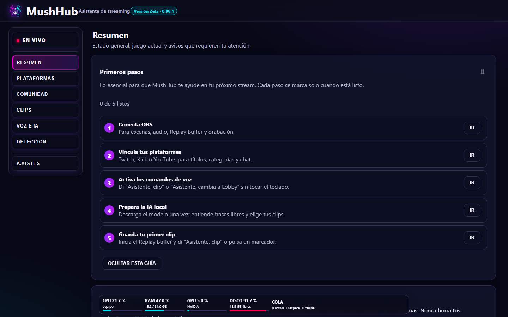
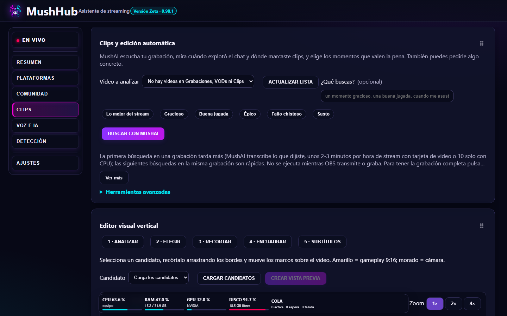
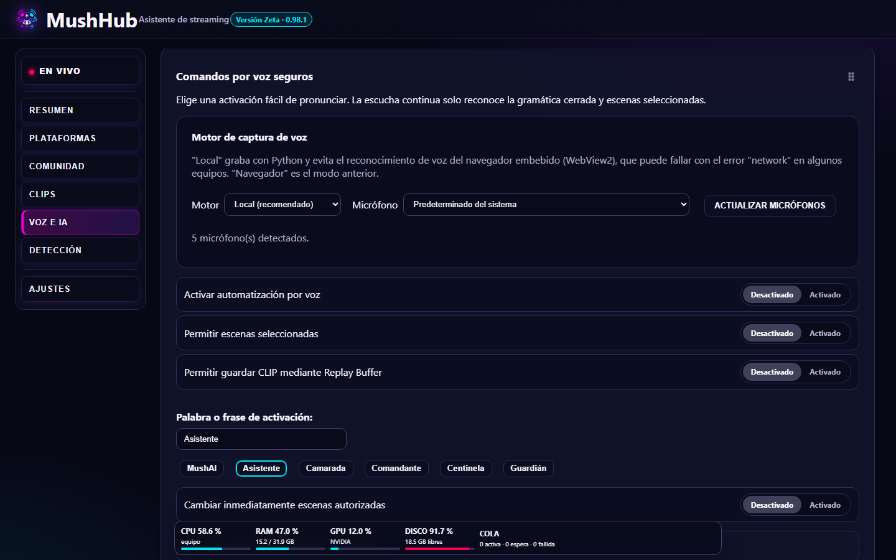

# MushHub
n🇺🇸 [Read in English](README.en.md)

**Asistente de streaming para Windows** — controla OBS con la voz, prepara títulos para Twitch, Kick y YouTube, junta el chat de todas tus plataformas y encuentra los mejores clips de tu stream con IA local.

> 📥 **[Descargar la última versión](https://github.com/Mushingames/MushHub-Descargas/releases/latest)** (instalador para Windows 10/11 de 64 bits)

## Qué hace

- 🎙️ **Comandos de voz**: "Asistente, cambia a Lobby", "Asistente, clip", "mutea el micrófono", "inicia la grabación"… sin tocar el teclado.
- 🤖 **MushAI (IA local, gratis y privada)**: entiende frases libres y te ayuda a preparar el stream. Corre en tu PC; no necesita cuentas ni pagar APIs.
- ✂️ **Clips con IA**: escucha tu grabación, mira cuándo explotó el chat y dónde marcaste momentos, y te propone los mejores clips con título. Puedes pedirle "un momento gracioso" o "una buena jugada".
- 📱 **Clips verticales**: recorta gameplay y cámara para TikTok/Shorts, con subtítulos automáticos.
- 💬 **Chat unificado** de Twitch, Kick, YouTube y TikTok, con emotes (7TV, BTTV, FFZ) y lectura en voz alta.
- 📝 **Títulos y categorías** para Twitch, Kick y YouTube, siempre con vista previa y tu confirmación.
- 🌐 **Español e inglés** (Ajustes → Sistema → Idioma / Language). En inglés, las carpetas de clips usan nombres en inglés. Los comandos de voz, por ahora, en español.

| Clips con MushAI | Comandos de voz |
|---|---|
|  |  |

## Requisitos

- Windows 10 u 11 de 64 bits.
- [OBS Studio](https://obsproject.com/) 28 o más reciente, con el servidor WebSocket activado (Herramientas → Configuración del servidor WebSocket).
- Para la IA local: se recomienda una tarjeta de video con 8 GB o más (funciona también sin ella, más lento). Con tarjeta de video, MushAI escucha una hora de stream en 2-3 minutos.

## Instalación

1. Descarga `MushHub-…-Setup-…-x64.exe` desde [Versiones](https://github.com/Mushingames/MushHub-Descargas/releases/latest).
2. Ábrelo. Como el instalador todavía no está firmado, Windows puede mostrar **"Windows protegió su PC"**: pulsa **Más información → Ejecutar de todas formas**.
3. Sigue el asistente inicial de MushHub (carpetas, OBS y tus plataformas).

MushHub te avisa solo cuando hay una versión nueva.

## Privacidad

Tus grabaciones, clips, chat y ajustes se quedan **en tu PC**. Las cuentas se conectan con la autorización oficial de cada plataforma (MushHub nunca ve tus contraseñas) y los accesos se guardan cifrados por Windows. MushHub no vende ni comparte tus datos.

## ¿Dudas o errores?

Escribe a **contacto.mushhub@gmail.com**. Si algo falla, adjunta el archivo `%LOCALAPPDATA%\MushHub\data\logs\mushhub.log`.

## Apoyar el proyecto

MushHub es gratuito. Si te sirve en tus streams, puedes apoyar su desarrollo:

---

MushHub es un proyecto independiente de [MushInGames](https://twitch.tv/mushingames) y no está afiliado a Twitch, Kick, YouTube, TikTok ni OBS. Uso sujeto a la licencia incluida en el instalador.
